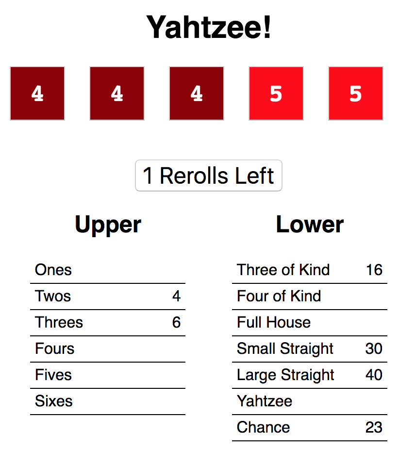

============
Yahtzee Game
============

Setup
=====

1) Clone this repository.

2) Install required npm libraries::

     $ npm install

3) Start WebPack::

     $ npm start

There are two versions of this: an incomplete, buggy version and the 
finished solution version in ``solution/``.

The Game
========

Yahtzee is a chance-and-strategy dice rolling game. A game is played over 13 rounds.

Each round, the player rolls five 6-sided dice. They may click on any number of dice
to "freeze" or "unfreeze" them (frozen dice are colored darker). They may re-roll the unfrozen dice
up to 2 times.

Each round, they must assign their dice to any unclaimed scoring category. Each category
scores differently.

After 13 rounds, the game is over, and the player's score is the total of each scoring category.

Scoring Categories
------------------

=================== ======================================= ==================
Category            Description                             Example Score
=================== ======================================= ==================
**Ones**            Score 1 for every 1                     ``1 1 2 3 4`` = 2
------------------- --------------------------------------- ------------------
**Twos**            Score 2 for every 2                     ``1 2 2 3 4`` = 4
------------------- --------------------------------------- ------------------
**Threes**          Score 3 for every 3                     ``1 2 3 3 3`` = 9
------------------- --------------------------------------- ------------------
**Fours**           Score 4 for every 4                     ``1 2 4 4 5`` = 8
------------------- --------------------------------------- ------------------
**Fives**           Score 5 for every 5                     ``1 2 5 5 5`` = 15
------------------- --------------------------------------- ------------------
**Sixes**           Score 6 for every 6                     ``1 2 3 6 6`` = 12
------------------- --------------------------------------- ------------------
**3 of Kind**       If 3+ of one value, score sum of all    ``1 2 3 3 3`` = 12
                    dice (otherwise, score 0)               
------------------- --------------------------------------- ------------------
**4 of Kind**       If 4+ of one value, score sum of all    ``1 2 2 2 2`` = 8
                    dice (else 0)
------------------- --------------------------------------- ------------------
**Full House**      If 3 of one value and 2 of another,     ``2 2 3 3 3`` = 25
                    score 25 (else 0)
------------------- --------------------------------------- ------------------
**Small Straight**  If 4+ values in a row, score 30         ``1 2 3 4 6`` = 30
                    (else 0)
------------------- --------------------------------------- ------------------
**Large Straight**  If 5 values in a row, score 40          ``1 2 3 4 5`` = 40
                    (else 0)
------------------- --------------------------------------- ------------------
**Yahtzee**         If all values match, score 50 (else 0)  ``2 2 2 2 2`` = 50
------------------- --------------------------------------- ------------------
**Chance**          Score sum of all dice                   ``1 2 3 4 6`` = 16
=================== ======================================= ==================

Example Round
-------------

The initial roll is: ``2 4 3 2 5``.

The player decides to try to get as many twos as possible, and clicks to
freeze both twos, then re-rolls, getting a new ``2 3 5``. 
They now have: ``2 2 3 2 5``.

The player decides to try for a full house, and freezes all of their
twos and their three (hoping to roll another 3 to get a full house). They
re-roll the die showing five, getting a ``6`` and now have ``2 2 3 2 6``.

Sadly, they didn't get their full house. They could score this as:

- *Twos*: for 6 points

- *Threes* for 3 points

- *Sixes*: for 6 points

- *Three of Kind:* (twos) for 15 points

- *Chance*: for 15 points

Any other category they claimed on this round would score 0.

Tasks
=====

Zero: Run the Solution and Play
-------------------------------

Run the version in the ``solution/`` directory and play a game or two
to get a sense of how things should work --- this is the version you'll be
working to build.

Then, stop this server and don't read the code in the ``solution/`` folder
unless you need a strong hint on a task.

One: Draw Diagram of Components
-------------------------------

Read through the source code and make a diagram of the components, along with
their props and state.

Two: Read ``Rules.js``
----------------------

The system for evaluating a roll score is handled by a series of object
oriented classes, since many of the rule are similar to each other.

There are lots of good things to notice here, so read this carefully.
In particular, what good practices of functional programmming (like use of
higher-order-functions) do you note? How is having this code be object-oriented
also useful?

Three: Add Missing Rules
------------------------

Two evaluation rule classes in ``Rules.js`` are incomplete:

- a full house should be 3 of one die and 2 of another, and should always
  score 25

- a small straight is four dice in a row (``1-2-3-4`` or ``2-3-4-5``, for example),
  and should always score 30

Write the classes for these rules.

Four: Prevent Rolling More than 3 Times
---------------------------------------

You should only get two chances per turn to re-roll, but the game has
a bug where you can re-roll as often as you want. Fix this!

Five: Disallow Re-Using Score Line
----------------------------------

The game currently lets you keep re-scoring the same scoring line (so you
can score 3 of a kind several times, whereas you should only be able to allocate
one set of dice here.) Fix this!

Six: Celebrate!
---------------

Nice job!

If you got this far, please **ask for a code review** and bring up any questions
that came up for you.

Further Play
============

There are lots of good ways to extend this game, letting you practice both
React-specific and JavaScript-general things. Pick the ones that interest you.

- It would be nice if the game started with the dice already rolled (rather 
  than having to click the button). Implement this.

- Show total score for each section & the overall score.

- Replace dice numbers with images of dice

- The look and feel is super-drab. Add some CSS. Perhaps even any animation
  for the dice when rolling!

- Add code to detect when the game is over, and add a "play again?" feature
  that resets the game.

- Add a new scoring category for "two pair" (scoring 15)

- Implement more complex scoring: you can find more
  complex rules to try out at https://en.wikipedia.org/wiki/Yahtzee#Yahtzee_bonuses_and_Joker_rules

